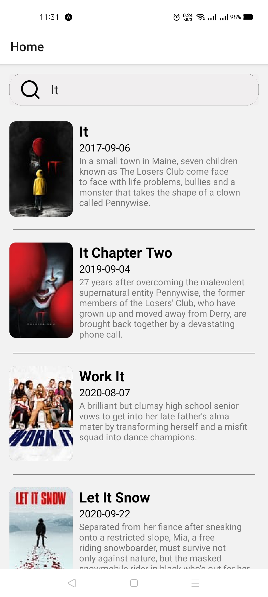
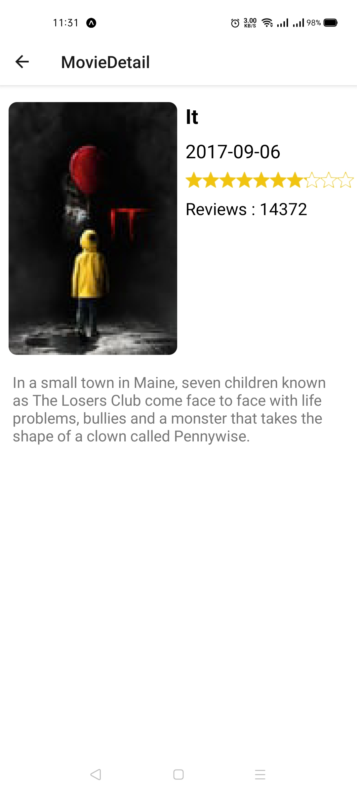

# Movies

An application used to help user search about any film by its name and show him a list of info about it like release date, average rate, and description. Built with React Native, JavaScript.

---
## Main technologies used
* [React Native](https://github.com/facebook/react-native)
> A framework for building native apps with React.
* [React Native Elements](https://github.com/react-native-elements/react-native-elements)
> Cross Platform React Native UI Toolkit.
* [React Native Victor Icons](https://oblador.github.io/react-native-vector-icons/)
> Customizable Icons for React Native with support for NavBar/TabBar, image source and full styling.
* [React Navigation](https://reactnavigation.org/)
> React Navigation provides a way for your app to transition between screens and manage navigation history.
---
## Try It
You can try it now using expo client on
* [Movies App](https://expo.io/@hamdyomran/projects/movies)
---

## Installation and Setup Instructions
Clone down this repository. You will need `node` and `npm` installed globally on your machine.
 
Installation:
 
`npm install`
 

To Run Test Suite:
 
`npm test`
 

To Start Server:
 
`npm start`
 

To visit app:
 
`http://localhost:19002/`

---
## Reflection
This was a 3 day long project. Project goals included using technologies learned up until this point and familiarizing myself with documentation for new features.

Originally I wanted to build an application that allowed users to search any film and show information about it. I started this process by using the create-react-app boilerplate, then adding react-native-navigation and setup all the UI components in addition to fetch data from API.

One of the main challenges I ran into was how to support pagination when the user reach the end of movies list. This lead me to spend a lot of time on a research, At the end I reached the soultion using flatlist onEndReached prop.

At the end of the day, the technologies implemented in this project are React Native and a significant amount of VanillaJS, JSX, and CSS. I chose to use the create-react-app boilerplate to minimize initial setup and invest more time in diving into weird technological rabbit holes. In the next iteration I plan on handrolling a webpack.config.js file to more fully understand the build process.

---
## Project Screen Shots

